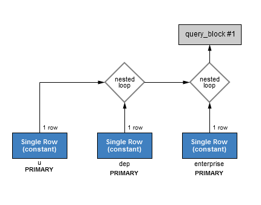

#基于索引的LEFT JOIN

[TOC]

##业务场景
**业务实体**
`用户`、`部门`、`企业`；

**业务关联**
`用户`属于某部门；`用户`属于某企业；

**数据库表**
使用同一张表表示`用户`、`部门`、`企业`，通过type区分；
```sql
DROP TABLE IF EXISTS `user`;
CREATE TABLE `user` (
  `id` int(11) NOT NULL AUTO_INCREMENT,
  `type` int(11) NOT NULL DEFAULT '0' COMMENT '0-企业,1-个人,2-部门',
  `name` varchar(64) NOT NULL DEFAULT '' COMMENT '名字',
  `phone` varchar(15) NOT NULL DEFAULT '' COMMENT '手机号',
  `address` varchar(100) NOT NULL DEFAULT '' COMMENT '联系地址',
  `email` varchar(50) NOT NULL DEFAULT '' COMMENT '联系email',
  `qq` varchar(20) NOT NULL DEFAULT '' COMMENT '联系 QQ',
  `enterprise_id` int(11) NOT NULL DEFAULT '0' COMMENT '企业ID',
  `dep_id` int(11) NOT NULL DEFAULT '0' COMMENT '所属部门ID',
  PRIMARY KEY (`id`)
) ENGINE=InnoDB AUTO_INCREMENT=32020001 DEFAULT CHARSET=utf8 COMMENT='用户';
```

**查询场景**
查询指定用户及其所属部门、所属企业
```sql
select
	u.id as '用户ID',
    u.name as '用户名称',
    dep.id as '部门ID',
    dep.name as '部门名称',
    enterprise.id as '企业ID',
    enterprise.name as '企业名称'
from user as u
left join user as dep on u.dep_id=dep.id
left join user as enterprise on u.enterprise_id=enterprise.id
where u.id=?;
```


##测试数据
本例通过generate-data模块完成测试数据插入（Java实现，不另做说明），注意Java中写死了使用test数据库。
其中：
企业信息：id:1-10000;
部门信息：id:10001-20000;
用户信息：id>20000，用户所属的企业与部门为随机值;

总数据量 > 2千万;


##案例分析

虽然user为千万级的表，但是无论是left join on条件，还是where条件，取的都是主键索引，因此非常快！


